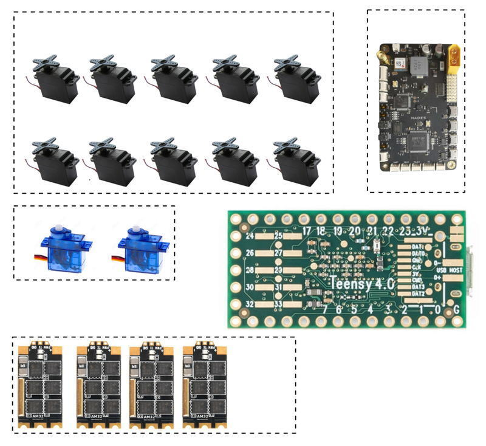

# Introduction
The T4-Board is servo and ESC controller board based on a Teensy 4 PCB providing full telemetry feedback of actuators.

This repository provides code and building instructions to have the capability to establish a connection between a Flightcontroller and a **T4-Board**, enabling the very speedy accurate control of motors and servomotors.

# Why
The **big bonus** of such a solution is the **feedback information** from all the servo and motor states. Realtime values of **Forces, Angles, RPM, Voltage, Current and what have you**. Yers, all those are returned values. This opens the opportunity to use these values in an autopilot control loop, so in the end to have much better controllability of an airframe. In the example setup, the refresh rate for the control and feedback of the motors is approximately 500 Hz, while the refresh rate for the control and feedback of the servos is approximately 350 Hz.

# Hardware
Servos can be controlled in both Serial Mode as well as PWM mode. For the servo hardware used, we had great success using the Feetech STS3032, SCS0009 and SCS2332 SCS servos. but any serial servos employing the Dinamixel half-duplex serial communication can be used. A more detailed explanation of this serial servos protocol can be found in this document: [serial_servo_protocol.pdf](docs/serial_servo_protocol.pdf). The user has the flexibility to determine the refresh time of the UART communication packets with the flightcontroller by modifying the "COMM_REFRESH_TIME" define in the [t4_servos_and_am32_escs_control_w_feedback.ino](./src/t4_servos_and_am32_escs_control_w_feedback/t4_servos_and_am32_escs_control_w_feedback.ino) source file. This define specifies the delay in microseconds for each subsequent packet sent back to a Flightcontroller.

Note that it is very well possible to use another MCU, the MCU used on this PCB offered a swift and relatively cheap way to a robust solution.

# Firmware
To compile the Firmware that needs to be flashed to a T4-Board one needs to [install Arduino IDE and Teensy support via instruction follow this link](https://www.pjrc.com/teensy/td_download.html). We used, and had great success with, v1.8.19. It is well possible a newer version even works, we did't try.

# Real-life use
The [Paparazzi UAV Autopilot stack](https://wiki.paparazziuav.org/) is already flying around using this solution, see [Paparazzi UAV with T4-Board](https://wiki.paparazziuav.org/) 
It is important to note that for using this T4-Board also in your autopilot, the **serial_act_t4** module should be added, and servotypes be set to *t4*, in your Airframe file. (Example is in the works...)

# Wiring
For example one can use four(4) AM32 ESCs with KISS telemetry out, 10 Feetech STS3032 servos and 2 PWM servos connected to a T4-Board wired via this configuration:

Example of a T4-Board wirering schematic as a guide to build you own solution:

 

**AM32 ESCs connection:**
|  ESCs | Signal PIN | Telemetry PIN |
| ----- | ---------- | ------------- |
| ESC 1 | 4 | 0 |
| ESC 2 | 8 | 7 |
| ESC 3 | 24 | 15 |
| ESC 4 | 9 | 25 |

**Feetech STS3032 servos connection:**
|  Servo number | Servo ID | PIN |
| ----- | ---------- | ------------- |
| Servo 1 | 1 | 20\*21 | 
| Servo 2 | 2 | 20\*21 | 
| Servo 3 | 3 | 20\*21 | 
| Servo 4 | 4 | 20\*21 | 
| Servo 5 | 5 | 20\*29 | 
| Servo 6 | 6 | 28\*29 | 
| Servo 7 | 7 | 28\*29 | 
| Servo 8 | 8 | 28\*29 | 
| Servo 9 | 9 | 28\*29 | 
| Servo 10 | 10 | 28\*29 | 

The asterisk (\*) symbol indicates that the pins need to be connected together. This common connection is required because the SerialBusServo utilizes a half-duplex serial protocol, where **transmission and reception** occur **on the same line**.

The **Servo ID** in this table above refers to the **ID of the Serial servo** that is connected to the BUS. The ID of the servo **must first** be set in the servo using a [TTLinker Mini](./docs/images/setservo_interface_example.jpg) with [ this schematic](./docs/images/setservo_interface_schematic.jpg') using [this TI SN74AHC1G04 inverter chip](./docs/images/ti_sn_74ahc1g04_inverter_chip.jpg) pre-made also available [for example this one](https://www.alibaba.com/product-detail/FeeTech-TTLinker-Board-for-SCS15-Servos_60415517086.html). There are numerous other suppliers to be found.

**Generic PWM servos connection:**
|  Servo number | PIN |
| ----- | -------- |
| Servo 11 | 2| 
| Servo 12 | 3| 

**Connection to the Flightcontroller:**
|  AP PIN | Teensy PIN |
| ----- | -------- |
| AP UART TX | 16| 
| AP UART RX | 17| 

# Protocols used

If you want to improve, debug and understand this solution, the following documents may come in handy:

## Serial Bus Servos

Implementation detail of the Serial Communication Servo (SCS) protocol to be found in this [serial_servo_protocol.pdf document](docs/serial_servo_protocol.pdf)

## DSHOT

[Read all about the DSHOT protocol on this site](https://brushlesswhoop.com/dshot-and-bidirectional-dshot/)

## KISS

[Get to know details about the KISS telemetry protocol in this document](docs/kiss_esc_telemetry_protocol.pdf)

## T4

To get more about the T4-Board protocol current state the sourceode is the base

# Links

A bunch of links we visited that helped in the quest towards this T4-Board solution.

## Halfduplex single wire on STM32

- https://github.com/rromano001/STM32_SINGLE-2-ONE_Wire/blob/master/README.md
- https://stm32f4-discovery.net/2017/07/stm32-tutorial-efficiently-receive-uart-data-using-dma/
- https://github.com/MaJerle?tab=repositories
- https://electronics.stackexchange.com/questions/484079/stm32-usart-1-wire-communication
- https://community.st.com/s/question/0D50X0000AIcacoSQB/uart-half-duplex-how-to-get-dma-working-for-both-rx-and-tx-on-stm32f303cc
- https://topic.alibabacloud.com/a/stm32-uart-single-line-half-duplex-mode-cube-version_8_8_31068692.html
- https://github.com/stm32-rs/stm32g0xx-hal/issues/70
- https://forum.chibios.org/viewtopic.php?t=5677

## Teensy UART related

- https://forum.pjrc.com/threads/33427-Rs485-halfduplex-for-Dynamixel-with-Teensy-3-1-without-external-Buffer-chip
- https://forum.pjrc.com/threads/63921-Bi-Directional-Serial-Comm
- https://forum.pjrc.com/threads/62653-Teensy-4-1-single-wire-half-duplex-UART
- https://github.com/KurtE/BioloidSerial/blob/master/dxlSerial.cpp
- https://github.com/PaulStoffregen/cores/pull/419
- https://github.com/PaulStoffregen/cores/commit/1268d2666f13b1e6cdb94e7ac111c8b57f308c64
- https://forum.pjrc.com/threads/62905-Teensy-4-1-software-Serial-for-one-wire-bi-directional-communication
- https://github.com/kurte/BioloidSerial

# Acknowledgements

- For the control of ESCs, the great [Teensyshot library is used](https://github.com/jacqu/teensyshot)
- Developers of the great [AM32 firmware for the Opensource ESC solution](https://github.com/AlkaMotors/AM32-MultiRotor-ESC-firmware)
- Original designers of DSHOT protocol
- KISS ESC telemetry protocol designers
- All the Drone enthousiasts in the world, **like you!**

